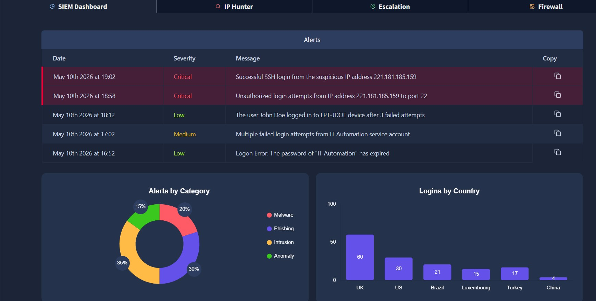
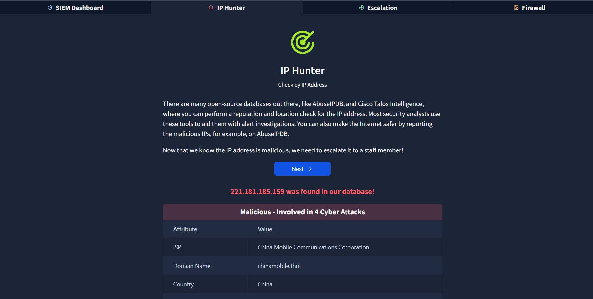
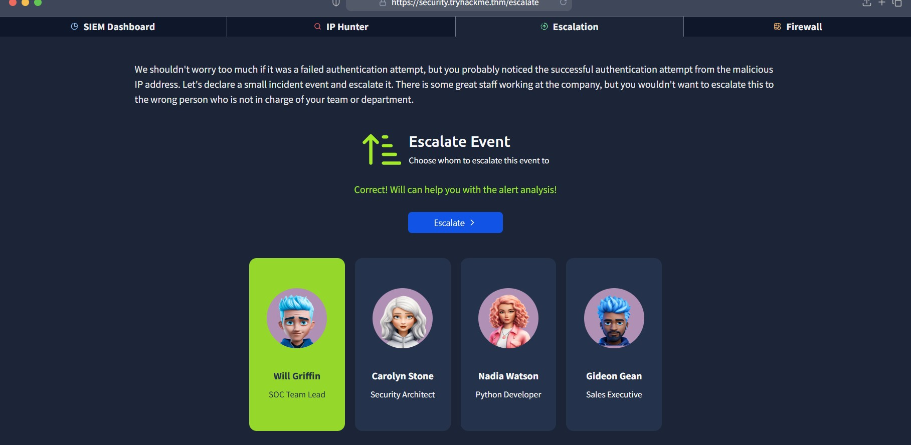
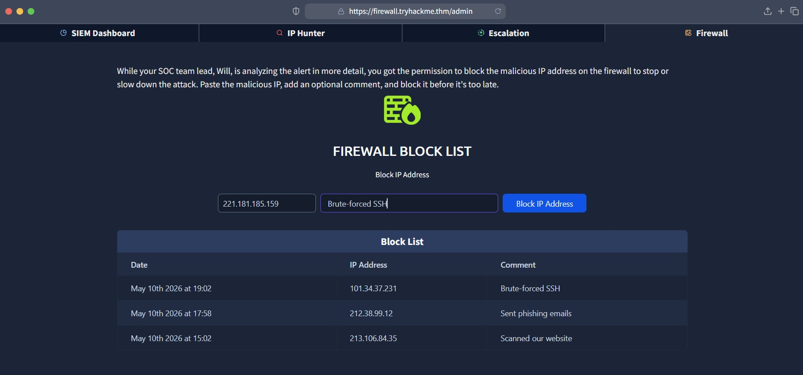
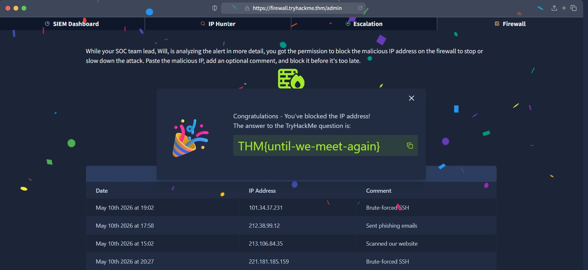

# Junior Security Analyst Intro

## Concepts Learned
- SIEM Dashboard Monitoring
- Alert Investigation
- IP Reputation Checking
- Threat Escalation
- Firewall Monitoring

## Tools & Concepts
- SIEM
- Threat Intelligence
- IP Hunter
- Incident Escalation

## Key Takeaways
Learned how SOC analysts investigate alerts, identify suspicious IP addresses and escalate incidents.

## Practical Skills
- Analyzing suspicious login alerts
- Investigating malicious IP addresses
- Understanding SOC workflows
- Monitoring security alerts

  ## SIEM Dashboard Investigation

## IP Reputation Analysis

## Event Escalation

## Firewall IP Blocking

## Task Completion

