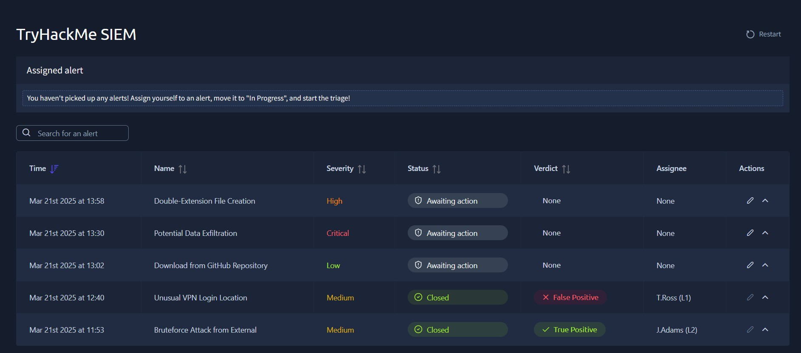
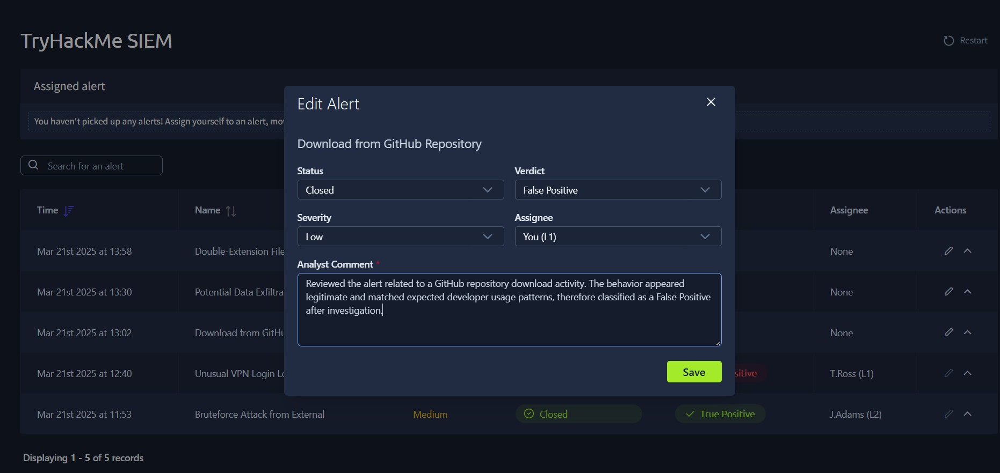
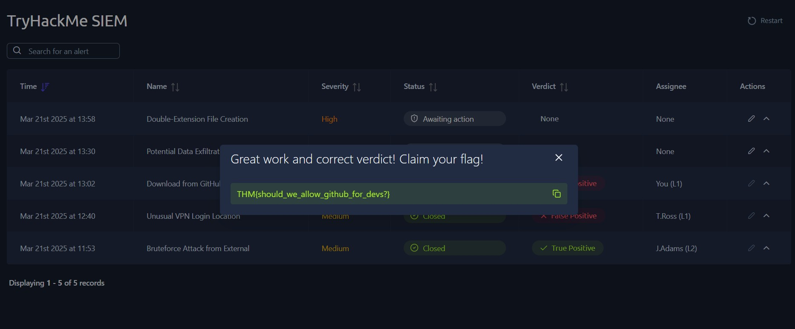

# SIEM Alert Monitoring

## About
This lab focused on monitoring alerts in a SIEM dashboard and analyzing suspicious activities.

## Skills Learned
- SIEM Dashboard Monitoring
- Threat Detection
- Alert Severity Analysis
- Incident Investigation
- Blue Team Operations

## Screenshot

